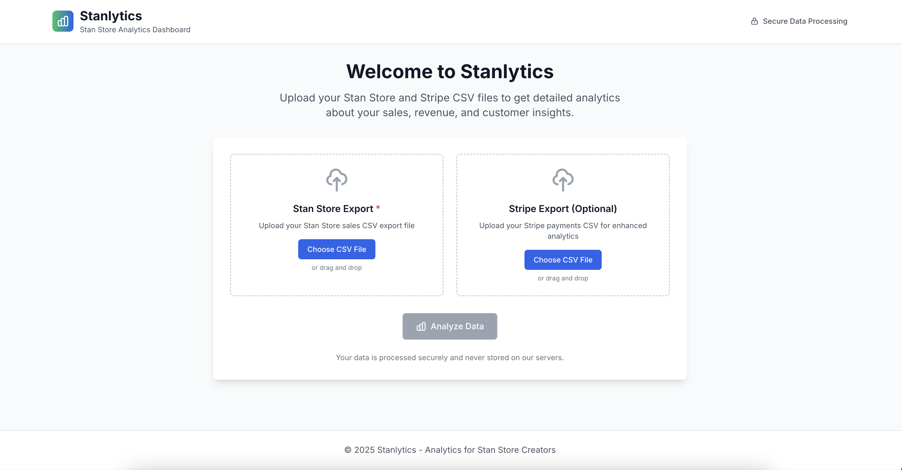
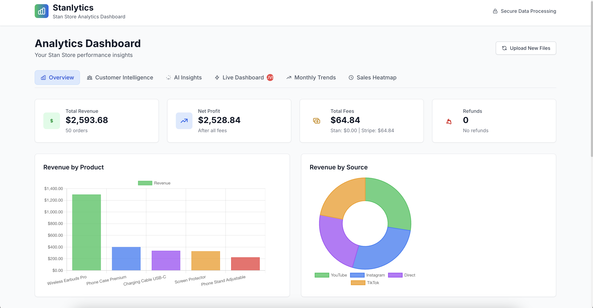
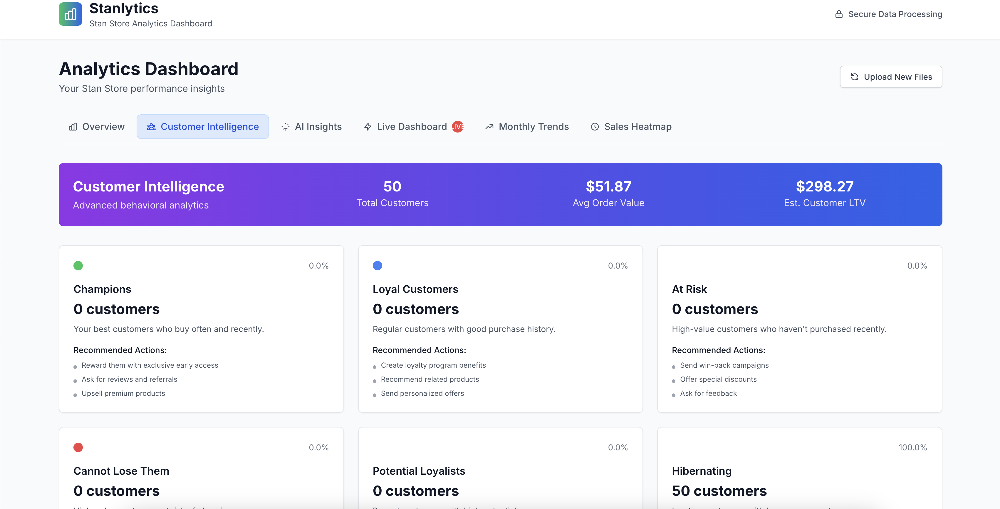
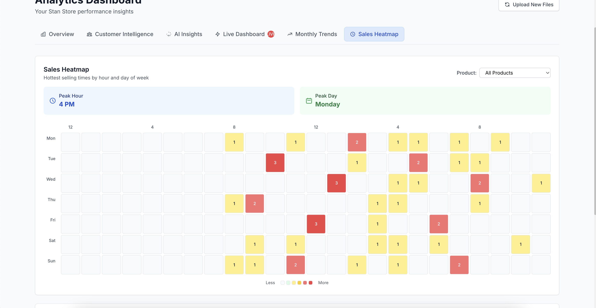

# 📊 Stanlytics – Advanced Analytics for Stan Store Creators

Stanlytics is a lightweight analytics dashboard built specifically for Stan Store creators who need better visibility into their sales, product performance, and profit — a pain point widely echoed by creators across Reddit and community forums.

> 🟢 Live Demo: [stanlytics.vercel.app](https://stanlytics.vercel.app)

---

## 🎯 Why This Exists

Many creators using Stan Store struggle to answer basic questions like:
- How much did I actually earn per product?
- How many units did I sell this week?
- What did I pay in Stan + Stripe fees?
- Were any of my sales refunded?

Stanlytics makes all of that instantly clear — no spreadsheets or calculators needed.

---

## ⚙️ Features

✅ Upload a CSV from either **Stan Store** or **Stripe**  
✅ Automatically parses totals, refunds, and fees  
✅ Clean summary cards for revenue, profit, and refund count  
✅ Bar chart visualizing **per-product revenue**  
✅ Product-level breakdown table  
✅ Works with both real and mock creator data  
✅ Mobile-friendly and deployed live on Vercel  

---

## 📷 Screenshots

> _(Add screenshots below once ready)_  
>   
>   
>   
> 

---

## 🛠️ Tech Stack

**Frontend**  
- React (CRA)
- Tailwind CSS  
- Chart.js via react-chartjs-2

**Backend**  
- Python  
- FastAPI  
- CORS-enabled API  

**Deployment**  
- Frontend: Vercel  
- Backend: Render (or local FastAPI server)

---

## 📁 Upload Formats

Stanlytics works with two CSV structures:

- **Stan Store CSV**
  - Columns like: `Product Name`, `Product Price`, `Total Amount`, `Payment Status`, etc.
- **Stripe CSV**
  - Columns like: `Amount`, `Amount Refunded`, `Fee`, `Net`, etc.

It automatically detects the format and adjusts the dashboard accordingly.

---

## 🧠 Built With Purpose

This project was built as a personal initiative to solve a real problem for creators — and to demonstrate what I can deliver to teams like Stan Store that value speed, clarity, and user empathy.

---

## 🤝 Want to Collaborate?

If you're a creator or engineer who wants to take this further — or if you're part of the Stan Store team — I'd love to chat.

Feel free to fork, contribute, or drop feedback via issues or DM.  
Made with ❤️ by [Shakeb Mohammed](https://linkedin.com/in/shakeb)

